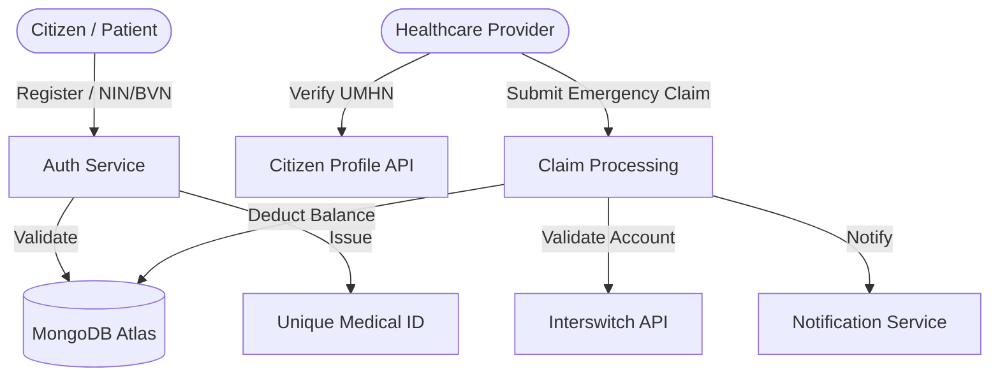

# PayLink-AI (NEMIS)
### National Emergency Medical Insurance System – Nigeria

**PayLink-AI** is a revolutionary fintech-healthcare hybrid platform designed to ensure that no Nigerian is denied life-saving emergency medical treatment due to financial barriers. By bridging the gap between identity verification (NIN/BVN), instant credit, and healthcare providers, we provide a 30-second verification-to-payment lifecycle.

## 🚀 The Problem
In Nigeria, many emergency patients face "death by delay" because hospitals require upfront payment before starting treatment. Financial barriers remain the leading cause of preventable mortality in critical care.

## 💡 The Solution
PayLink-AI (NEMIS) provides:
- **Instant Identity Verification**: Seamless integration with NIN and BVN via robust middleware.
- **Micro-Credit Enrollment**: Automatic ₦20,000 emergency medical fund for verified citizens.
- **Unique Medical Health Number (UMHN)**: A portable, federal-standard health ID for national portability.
- **Direct-to-Provider Settlement**: Guaranteed 30-second payment settlements to hospitals to trigger immediate care.

---

## 🏗 System Architecture

## 🛠 Tech Stack
- **Frontend**: React 19, Vite, Tailwind CSS, Lucide Icons, Framer Motion.
- **Backend**: Node.js, Express 5, Mongoose 9.
- **Database**: MongoDB Atlas.
- **Integrations**: Interswitch (Payment & Bank Validation), Ethereal (Notification System).

---

## 👥 Team & Contributions

### Muazu Abdullahi Muhammed
**Project Lead (NEMIS Initiative)**

As the Project Lead for PayLink-AI, Muazu was responsible for driving the strategic vision, cross-functional coordination, and execution of the platform during the Interswitch Hackathon.

**Core Responsibilities:**
- **Product Vision & Strategy**: Conceptualized PayLink-AI as a "Credit-First" healthcare solution to solve the critical "payment-before-treatment" barrier.
- **Team Coordination**: Managed collaboration between developers, designers, and AI specialists to ensure a cohesive prototype within hackathon deadlines.
- **System Design Oversight**: Supervised the end-to-end user flow (Patient → Provider → Interswitch Integration) and eligibility logic.
- **Feature Prioritization**: Led the planning for the deferred payment system, UMHN generation, and healthcare facility onboarding.
- **Quality Control & Delivery**: Reviewed frontend/backend modules to ensure the final product aligned with the national health mission and hackathon requirements.

**Key Impacts:**
- Transformed a conceptual idea into a structured, implementable national health infrastructure prototype.
- Guided the integration of Fintech (Interswitch) + Healthcare (NEMIS) + Identity (NIN) systems.
- Maintained a relentless focus on user impact, scalability, and real-world applicability in the Nigerian context.

---

### [Name of Frontend Developer]
**Frontend Developer**

*(Contribution details to be added: UI/UX implementation, state management, and Lucide/Framer integration.)*

---

### [Name of Backend Developer]
**Backend Developer**

*(Contribution details to be added: API design, MongoDB schema management, and Interswitch service integration.)*

---

## 🏁 Getting Started

1. **Clone the repo**: `git clone https://github.com/Linkxee-Tech/PayLink-AI`
2. **Install Root Dependencies**: `npm install`
3. **Setup Environment**: Create a `.env` in the `backend/` folder using `.env.example`.
4. **Run Development**: `npm run dev`

---
© 2026 PayLink-AI / NEMIS Project. Developed for the Interswitch Hackathon.
